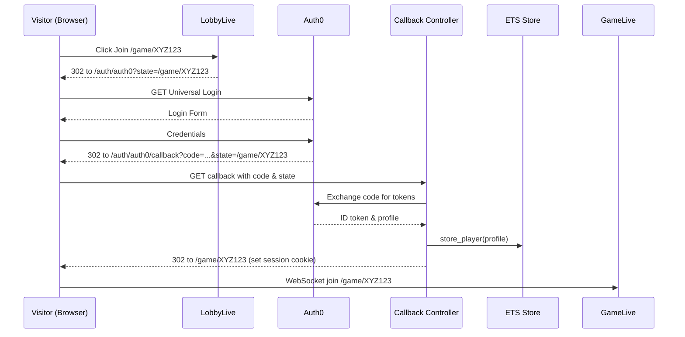

# Lora Game – Authentication and Enhanced Lobby SRS (v 0.2-draft)

## 1. Scope
Add user authentication and improve lobby flow for the existing **Lora** game MVP. Authentication relies on **Ueberauth + Auth0** with no durable persistence. Anonymous visitors may browse the lobby list, but **must authenticate** before creating or joining a game.

## 2. Definitions
| Term | Meaning |
| --- | --- |
| **Anonymous Visitor** | Unauthenticated user browsing the lobby page. |
| **Authenticated Player** | User logged in through Auth0 and cached in ETS. |
| **State Param** | OAuth2 `state` value that carries the **target redirect path** (e.g. `/game/XYZ123`) through the Auth0 round-trip. |
| **Callback URL** | `/auth/auth0/callback` handled by Ueberauth after Auth0 login. |

## 3. Actors
- **Visitor** – accesses the lobby without logging in.  
- **Player** – authenticated user who can create or join a game.  
- **Auth0** – external identity provider (Universal Login).  
- **System** – Phoenix app with Ueberauth plug chain and in-memory session store.  

## 4. Functional Requirements

### 4.1 Authentication
| ID | Requirement |
| --- | --- |
| **AUTH-A-01** | Integrate `ueberauth` and `ueberauth_auth0`. |
| **AUTH-A-02** | `/auth/auth0` initiates login; `/auth/auth0/callback` processes Auth0 response. |
| **AUTH-A-03** | Use Auth0 Universal Login (redirect flow, no embedded widget). |
| **AUTH-A-04** | On successful callback, extract `sub`, `name`, `email` into `%Player{}`. |
| **AUTH-A-05** | Store `%Player{}` in ETS via `Lora.Accounts` context facade. |
| **AUTH-A-06** | Maintain Phoenix session cookie with `player_id` referencing ETS record. |
| **AUTH-A-07** | Provide `/logout` route that clears session and purges ETS entry. |

### 4.2 Lobby Flow
| ID | Requirement |
| --- | --- |
| **AUTH-L-01** | `/lobby` lists open game codes and a **Create Game** button (visible to all). |
| **AUTH-L-02** | *Join* or *Create* triggers an auth guard; unauthenticated users are redirected to `/auth/auth0?state=<url_encoded_target_path>`. |
| **AUTH-L-03** | After callback the app reads `conn.query_params["state"]` (decoded) to decide next redirect. |
| **AUTH-L-04** | If `state` is `/lobby#create`, create a fresh game and redirect to its URL. |
| **AUTH-L-05** | If `state` is `/game/<code>`, attempt to join; on success redirect there, else flash error and return to lobby. |
| **AUTH-L-06** | Authenticated user’s name appears in lobby header with logout dropdown. |

### 4.3 Security & Session
| ID | Requirement |
| --- | --- |
| **AUTH-S-01** | Use encrypted Phoenix session cookies (`encrypt: true`). |
| **AUTH-S-02** | ETS player entries expire 30 min after last touch via periodic sweep. |
| **AUTH-S-03** | Ensure CSRF protection on `/auth/auth0/callback` (Ueberauth default). |

## 5. Non-Functional Requirements
| ID | Requirement |
| --- | --- |
| **AUTH-NFR-P-01** | Use `ueberauth` ≥ 0.11 and `ueberauth_auth0` ≥ 0.9. |
| **AUTH-NFR-P-02** | Hide persistence behind `Lora.Accounts` behaviour so future adapters (Ecto, microservice) can be swapped without touching controllers or LiveViews. |
| **AUTH-NFR-P-03** | Typical added latency for auth round-trip **< 1500 ms**. |
| **AUTH-NFR-Q-01** | ExUnit tests mocking Auth0 responses: success, invalid state, expired session, join failure. |

## 6. Architecture Changes
- **Plug Pipeline**: `:browser` now includes `Ueberauth` and `LoraWeb.Plugs.RequireAuth`.  
- **Context**: `Lora.Accounts` provides `get_player/1`, `store_player/1`, `delete_player/1` with ETS adapter.  
- **LiveViews**: `LobbyLive` handles auth redirects; `GameLive` mounts only when `current_player` assigned.  
- **ETS Table**: `:players`, key = Auth0 `sub`, value = `%Player{}` plus `inserted_at` timestamp.  

## 7. Auth0 Configuration

**Allowed Callback URLs**
```
https://your-host/auth/auth0/callback
http://localhost:4000/auth/auth0/callback
```

**Allowed Logout URLs**
https://your-host/
http://localhost:4000/

**State Parameter examples (URL-encoded)**
```
state=%2Flobby%23create # create a new game after login
state=%2Fgame%2FXYZ123 # join existing game /game/XYZ123
```

## 8. Sequence Diagram (textual)
1. Visitor clicks **Join game XYZ123**.  
2. `LobbyLive` pushes redirect to `/auth/auth0?state=%2Fgame%2FXYZ123`.  
3. Browser loads Auth0 Universal Login.  
4. User authenticates.  
5. Auth0 redirects to `/auth/auth0/callback?code=…&state=%2Fgame%2FXYZ123`.  
6. Ueberauth exchanges code and obtains profile.  
7. Controller stores player in ETS, sets session `player_id`.  
8. Controller redirects user to `/game/XYZ123`.  




## 9. Deliverables
1. Updated Mix dependencies (`ueberauth`, `ueberauth_auth0`).  
2. `Lora.Accounts` context with ETS adapter and behaviour spec.  
3. Router updates for auth routes.  
4. `LoraWeb.Plugs.RequireAuth`.  
5. Modified `LobbyLive` and templates.  
6. Test suite for auth flow.  